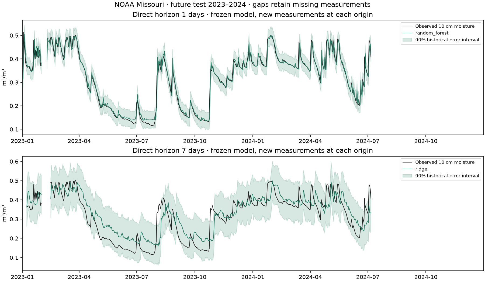

# Agricultural Time-Series Forecasting

Direct forecasts of measured soil moisture at one and seven days, with purged expanding backtests, demanding baselines and observed interval coverage.



## Problem and objective

Predict future volumetric soil moisture at 10 cm from historical sensor/weather measurements. This is continuous forecasting, distinct from the portfolio's below-threshold screening task. Each origin uses newly observed history; seven-day predictions are direct forecasts, not seven recursive predictions or an open-loop season simulation. No future weather, irrigation decisions or crop-specific labels are used.

## Dataset and coverage

[NOAA USCRN daily data](https://www.ncei.noaa.gov/pub/data/uscrn/products/daily01/), Missouri Chillicothe 22 ENE, 2016–2024: 3,288 daily rows. Soil moisture units m³/m³; air temperature °C, rainfall mm, radiation MJ/m²/day and humidity %. [Source hashes](data/source-manifest.json) and [schema](data/source-headers.txt) are fixed. NOAA-produced data are public domain in the United States under [NCEI policy](https://www.ncei.noaa.gov/sites/default/files/2023-12/NCEI%20PD-10-2-02%20-%20Open%20Data%20Policy%20Signed.pdf); code is MIT.

The initial Iowa candidate had almost no valid soil measurements in 2022 and no seven-day validation pairs. The Missouri site was selected based on **training/validation coverage**, before any model test evaluation. The [yearly coverage table](reports/coverage.csv) documents missing periods, including unavailable measurements in the second half of 2024. Plots show the whole declared test window with gaps; there is no filled or invented target. Metrics apply only where origin and target moisture are actually observed. These reference sites are not verified farm parcels.

## Workflow and leakage control

```text
Real source files → hash/schema checks → uninterrupted daily calendar
→ measured origin-day inputs, historical lags/rolling features → horizon-specific target
→ purged expanding folds 2021/2022 → select by pooled validation RMSE
→ refit through 2022 → frozen 2023–2024 test → forecasts and historical-error intervals
```

Calendar reindexing makes a seven-row shift exactly seven days. Folds train only on target dates before validation origins. Imputation and scaling are fitted within each training fold, never across validation. Final train uses targets before 2023-01-01; final test origins are on/after that date, targets through 2024-12-31. The model stays frozen while new measured history arrives at each daily origin. Revised retrospective data and sensor reporting latency limit operational claims.

## Methods and actual results

Persistence predicts the current value. Seasonal climatology fits a circular ±15-day target-day mean from historical observations. Ridge uses train-fitted imputation and standardization, alpha 1. Random Forest uses 160 trees, depth 12, leaf minimum 5, seed 42. Hyperparameters are fixed. Select independently for each horizon using pooled validation RMSE, then evaluate test without reselection.

| Horizon days | Method | Validation RMSE | Test RMSE | Test MAE | Test R² |
|---|---|---:|---:|---:|---:|
| 1 | persistence | 0.03103 | 0.02369 | 0.01290 | 0.9565 |
| 1 | seasonal_climatology | 0.09521 | 0.10820 | 0.08536 | 0.0921 |
| 1 | ridge | 0.02704 | 0.02124 | 0.01318 | 0.9650 |
| 1 | random_forest | 0.02656 | 0.02127 | 0.01212 | 0.9649 |
| 7 | persistence | 0.07080 | 0.06156 | 0.04476 | 0.7022 |
| 7 | seasonal_climatology | 0.09547 | 0.10923 | 0.08652 | 0.0624 |
| 7 | ridge | 0.06432 | 0.06011 | 0.04982 | 0.7161 |
| 7 | random_forest | 0.07134 | 0.06654 | 0.05530 | 0.6521 |

Errors use m³/m³. Selected: **Random Forest at one day**, **Ridge at seven days**. Ridge has a slightly smaller one-day test RMSE, but the validation-selected forest is retained. At seven days Ridge modestly improves RMSE over persistence while worsening MAE: the metric tradeoff is explicit, not an across-the-board improvement claim. No LSTM/GRU is added merely to increase complexity; the sample is small and persistence already performs strongly.

Historical residual intervals use a finite-sample 90th-percentile absolute error from the selected method's validation forecasts, then are clipped to [0,1]. Observed test coverage: **93.0%** at one day, **94.9%** at seven days. Serial dependence, model selection and drift prevent any distribution-free coverage guarantee. The seven-day band is wide; its coverage should be read with its width. Full [backtests](reports/backtest.csv), [metrics](reports/metrics.json), [method comparison](reports/comparison.csv) and [per-origin predictions](reports/test-predictions.csv) are stored.

## Run

Python 3.12, from a source clone:

```bash
python -m venv .venv
# Activate .venv using your platform's command.
python -m pip install -r requirements-lock.txt
python -m pip install --no-deps -e .
python -m agriforecast.train
python -m pytest -q
```

The first run downloads nine small NOAA text files; hashes fail explicitly if the source is revised. Raw measurements and trusted locally trained joblib artifacts remain ignored. `agriforecast.modeling.predict` accepts the saved horizon state and an aligned feature table; all baseline definitions are saved with the model. The source ZIP contains code/reports, not raw data or trained artifacts.

`src/agriforecast`: data/calendar/features, modeling/folds/intervals and training/reporting. `configs`: fixed study choices. `reports`: executed results. [Notebook](notebooks/01_evidence.ipynb), [verification](docs/verification.md), [French learning guide](docs/learning-guide.md), [interview notes](docs/interview-notes.md) and [design](docs/design.md).

## Limits and improvements

One location, shallow moisture, selective missingness, retrospective finalized weather, serially correlated overlapping horizons and wide longer-horizon intervals. No independent-site generalization, actual irrigation decision or crop water-saving effect is measured. Add independent sites, report block-resampled uncertainty, measure operational reporting latency and compare genuine weather forecasts on a new untouched period before advancing this prototype.

Developed with AI assistance. All numbers come from executed source data. Remote CI evidence is linked below; it checks software contracts and stored notebook structure, without independently validating forecast performance.


## GitHub publication

[Public repository](https://github.com/idrisslemnouni-crypto/agriculture-time-series) · [Current CI results](https://github.com/idrisslemnouni-crypto/agriculture-time-series/actions). Published following the user's explicit 5 October 2026 request to release the prepared portfolio together. Earlier local-verification notes describe the pre-publication checkpoint. Raw sources and trained artifacts remain excluded from Git; reproduction commands regenerate them.

## Calendar contract update — 6 October 2026

Forecast features reject missing or blank station identifiers, missing dates, non-datetime dates, intraday timestamps, duplicate dates and gaps. A positive, nonboolean integer horizon therefore maps an observation to an exact future calendar day; missing observations remain missing targets. The cached NOAA one-day and seven-day feature tables reproduce their previous hashes exactly. Existing models, evaluated predictions and scores are retained; this input-contract correction does not create a new independent test.
